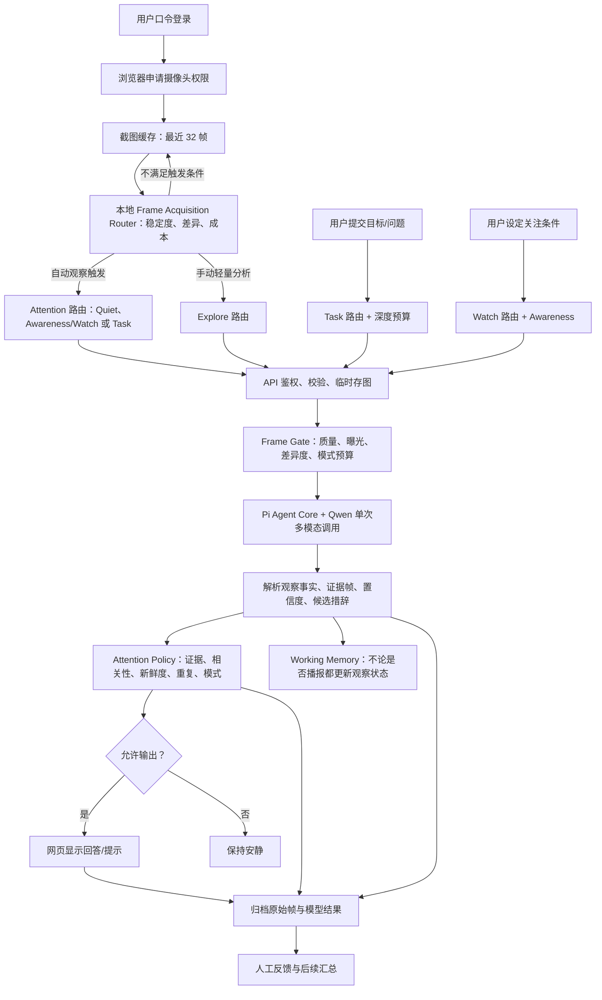

# 第一视角视觉助理：当前完整架构与行为规格

这份文档描述**当前代码实际会做什么**，不是未来设计清单。读者可以用其中的触发条件和策略规则推断：给定摄像头状态、用户动作、活动任务和截图，系统会不会调用模型、会送哪些帧、更新什么状态、是否向用户显示结果。

## 1. 产品范围与关键区分

当前产品是手机浏览器中的 2D 摄像头试用工具。浏览器采集的是一串带时间戳的截图；发给 Qwen 的是触发时筛出的图片序列，不是连续视频。系统不依赖 ARKit、ARCore 或 3D 重建；在浏览器允许时使用 IMU 的短时旋转/加速度摘要，但没有绝对位移、空间地图或可靠的用户身体朝向信息。

必须区分以下四件事：

1. **抓拍**：浏览器是否从摄像头取出一张图片。
2. **调用感知模型**：本地路由是否把一组截图发给 Qwen。
3. **更新内部状态**：模型观察是否写入场景、事件、实体记忆。
4. **向用户输出**：策略是否允许把候选回答显示在网页上。

架构的决策中心是“用户是否需要一条新的信息”，不是“像素是否变化”。当前代码用显式用户请求、Task/Watch 条件、已呈现事实、证据新鲜度和近乎相同的已见视野缓存近似这个判断；语义级的用户熟悉场景记忆和完整个性化信息增益模型仍未实现。

因此，摄像头转向可能让本地路由请求一次静默场景更新，但不应自动生成“你转身了”之类的播报。Quiet 的含义是**安静地感知和更新状态**，不是停止识别。

## 2. 一张图看完整条请求链路

主要运行入口是 `web/` 的浏览器界面、`src/trial-server.ts` 的本地服务，以及 `src/agent/` 下的感知、记忆和策略模块。

## 3. 用户进入系统后会发生什么

### 3.1 登录与会话

用户打开网页后先输入体验口令。成功后，服务端生成 session ID 和 token；网页把它们保存在当前标签页的 `sessionStorage`。token 默认有效 4 小时。每个 session 在服务器内存中有自己的 `VlmAgent` 和工作状态。

服务默认监听 `127.0.0.1:8765`。手机摄像头通常要求 HTTPS，因此手机体验要通过 HTTPS 隧道或等效方式打开服务，并由浏览器明确授权摄像头。服务端不把 Qwen API Key 发给浏览器。

### 3.2 摄像头开启

用户点“开启摄像头”并授权后：

- 浏览器优先请求后置摄像头，关闭麦克风采集。
- 页面立即抓拍一帧，并默认开启自动观察。
- 后续按用户选择的 1、2 或 5 秒间隔抓拍。
- 每帧最长边缩到 640 像素，编码成质量 0.72 的 JPEG。
- 浏览器内存只保留最近 32 帧；超出的预览 URL 会释放。
- 每帧在本地估算 Laplacian 清晰度和过暗/过亮像素比例，并保留 32×24 灰度签名；同时读取浏览器可用的陀螺仪角速度和线性加速度，生成短窗口运动摘要。这些小型指标随被选截图发给服务器，完整截图仍只在触发分析时上传。

用户可以暂停自动观察而保持摄像头开启；暂停后仍可手动抓拍和手动分析。手动抓拍本身不请求模型。关闭摄像头会停止视频轨道、自动抓拍和自动观察。

## 4. 本地 Frame Acquisition Router：什么时候保留和提交画面

Router 在浏览器运行，不使用 VLM。它的职责是抓拍、估计设备运动模式、等待画面稳定、合并触发和控制调用频率。32×24 灰度签名只能说明画面像素是否变化，不能说明变化对用户有没有价值，也不能识别场景语义；它不参与运动模式分类。IMU 的角速度和姿态用于估计累计转动，加速度在姿态可用时用于低置信度的相对路径估计；它们不提供绝对位移，低加速度也不表示静止。

当前关键阈值：

| 参数 | 当前值 | 代码含义 |
|---|---:|---|
| 截图频率 | 固定 1 秒 | 浏览器本地每秒缓存一张；VLM 只在 Router 触发或用户提问时接收所选帧 |
| 连续帧稳定参考值 | 0.04 | 最近 5 次相邻签名比较中至少 3 次低于此值，才作为画面稳定证据；单帧差异不会清空稳定计数 |
| 视觉新颖度参考值 | 0.10 | 最近 5 帧中至少 3 帧相对上次分析基线达到此差异，才触发候选观察；不等于语义场景变化 |
| 分析最小间隔 | 5 秒 | 变化触发必须距上次成功分析至少 5 秒 |
| 触发冷却 | 8 秒 | 两次 Router 触发至少间隔 8 秒 |
| 可疑关注复核 | 至少 5 秒 | Watch 返回 suspected 后，等待新截图再请求一次复核 |
| Awareness 定期复查 | 15 秒 | Watch 活跃期间即使没有显著变化，也定期复查关注条件 |

运动摘要根据最近 8 秒的传感器窗口计算，不由某一条角速度或某一张截图决定。它不把运动压缩成一个互斥类别，而是分别给出三个不变量状态：位置是否无显著变化、摄像头朝向是否无显著变化、行进方向是否无显著变化。每项状态可为 `no_significant_change`、`significant_change` 或 `unknown`。姿态用窗口内的稳健方向范围和首尾净转角/累计转动路径比例估计；位置只在姿态变化范围有限时，依据去除每轴中位数偏置及自适应噪声底后的加速度积分作低置信度估计；行进方向看净位移估计相对总路径的一致性。加速度方差用于辅助识别分散运动。浏览器姿态不可用、窗口样本不足或指标互相矛盾时，对应维度归为 `unknown`，不会把 unknown 当成不变。

首版判定参考值是窗口姿态范围 18°、净转角 15°、净位移估计 0.12m、路径一致性 0.58；方向明显不一致的参考值为 0.40。这些是累计窗口统计的初始判定边界，不是瞬时角速度阈值。朝向仅在净转角达到边界且累计转动方向一致时标为显著变化；位置需要有限的朝向变化范围和可用的加速度积分结果；行进方向只有在位置变化证据成立后才判断。数据落在边界之间或不同传感器证据冲突时返回未知。

这些状态是短时间窗的不变量线索，不是精确位移或用户绝对朝向。这里的“位置”来自手机运动的相对估计，不是世界坐标；“朝向”是摄像头朝向的估计，不保证等于用户身体朝向；“行进方向”只表示整体路径是否一致，VLM 不会收到具体方向向量或速度。加速度积分会受传感器偏置、采样间隔和手机姿态影响，所以位置或行进方向证据置信度较低；只有方向估计可靠时才标为显著变化或无显著变化，其余情况保留未知。手抖若主要在有限姿态范围内往复，首尾净转角和净位移都小，不会仅因瞬时峰值就判为状态变化。匀速平移又可能没有可观测加速度，因此位置与行进方向可能是 unknown。

Router 根据三个不变量状态生成内部帧预算类别：位置与朝向都无显著变化时用静止预算；一个维度显著变化时用有序变化预算；两个及以上维度显著变化时用较高运动预算；没有确认变化且关键维度未知时用保守预算。一次角速度峰值、加速度尖峰或截图差异都不会单独触发运动门控。Awareness 的 15 秒定期复查仍会运行，手动提问也不受这个门控限制。屏幕端先合并近重复截图；运动证据存在时保留相关帧，并在上限内优先覆盖运动和画面变化、保留时间窗首尾。原始传感器短窗读数只留在实验记录中。Frame Gate 汇总整组帧的不变量状态，并按不变维度的组合确定输入帧预算。VLM 只接收 `MOTION_INVARIANTS` 中的位置、摄像头朝向、行进方向状态和粗略置信度，不接收逐帧角速度、加速度、速度值、方向向量或原始轨迹。VLM 仍须从画面语义和已有场景状态判断场景是否变化。

Router 每次抓拍依次处理：

1. 维护最近 5 次相邻截图差异。至少 3 次差异不超过 0.04 才累计稳定帧；一次手抖或单帧画面异常不会清零稳定计数。运动分类来自同一份 8 秒传感器窗口。
2. 位置、摄像头朝向或行进方向中有一项或多项显著变化时，普通变化触发等待；状态回到稳定后再继续。仅某个维度发生变化不会直接决定是否播报。
3. 若距离上次分析至少 5 秒，且最近 5 帧中至少 3 帧相对上次分析基线的差异达到 0.10，触发 `visual_change_after_stabilization`。签名只用于筛出持续的候选画面变化，不会参与运动模式推断；VLM 仍须判断语义场景是否变化。
4. 每次普通变化触发还必须通过 8 秒冷却检查。

成功处理过的 Quiet 截图会把其 32×24 签名保存在浏览器本地，最多 24 个。稳定的新截图若相对任一已知签名的平均像素差不超过 0.012，就复用已存场景状态、更新 Router 基线并跳过 Qwen；这个阈值故意较严格，只识别近乎相同的取景，不声称理解了语义上相同的地点。该跳过数记入 `familiarSceneFramesSkipped`。

开启自动观察时 Router 以最近截图初始化基线和分析时间；如果缓冲区当时还没有截图，第一张稳定截图会触发 `initial_stable_scene`。分析成功后，Router 将本次时间窗的最新截图设为新基线，并把分析游标移到该时间窗末尾。

稳定画面首次建档或持续的像素变化可以进入 Quiet 更新；场景保持不变时没有周期性 heartbeat 调用。若累计运动模式仍为旋转、可能平移或无规则运动，普通变化触发会等待；Watch 的可疑复核仍要等待稳定的新截图和冷却期。Awareness 的定期复查会按 15 秒间隔继续检查；帧门控依传感器运动类别增加输入帧数。转动停止后，如果画面趋稳，Router 会把当前代表帧交给 VLM；旋转状态本身不构成场景变化。

当位置与摄像头朝向都无显著变化时，Quiet 和 Awareness 都只向服务端发送一张代表截图。只有朝向变化、只有位置变化，或位置变化但行进方向整体一致，都归入较低的有序预算；多个不变量同时变化或行进方向明显不一致时增加帧数。Quiet 分别最多选 3/5 张、Awareness 最多选 4/6 张；关键状态未知时使用静态预算。VLM 看到的是每个维度是否保持稳定，不会看到具体速度或方向。截图频率仍为每秒一次，但模型调用不会因此每秒增加。Task 和 Explore 保留较大的交互帧上限。手机稳定时更容易得到连贯证据，移动时会增加画面解释难度。

**因此用户转身时的预期行为是**：转动期间暂缓普通触发；画面稳定并达到变化阈值后，Quiet 可以更新当前场景状态，但不会因为转身本身播报。画面持续稳定且没有活动任务/关注条件时，不会定时请求 VLM。

如果分析正忙：

- 自动触发只保留一个待处理原因；多个触发会合并，不会无限排队。
- 当前请求结束后，用更新后的截图时间窗补做一次观察。
- 用户新提交的深度目标会排在自动观察之前；若连续提交，排队目标被最新目标替换。
- 用户在分析中结束任务，则当前分析结束后先清除任务和待处理请求；摄像头与基础 Quiet 观察不因此关闭。

## 5. 注意力模式如何路由

注意力模式决定帧预算与输出策略。它不等同于模型思考预算。**网页提供四个清晰的模式按钮，不让 VLM 自己切换模式。** Quiet 开启基础自动观察，Awareness 开始条件关注，Task 开始目标协助，Explore 单次分析当前画面。

### 5.1 当前网页路由

| 场景/动作 | Attention Mode | 推理预算 | `userInitiated` | 当前行为 |
|---|---|---|---:|---|
| 摄像头自动观察，没有活动任务或关注条件 | `quiet` | `economy` | 否 | 首次稳定画面或稳定变化时更新场景；静止时不做周期调用 |
| 摄像头自动观察，正在关注条件 | `awareness` | `economy` | 否 | 检查关注条件；疑似发生时等待新截图复核，确认后提示一次 |
| 用户点击“轻量检测变化”，没有活动任务 | `explore` | `economy` | 是 | 作为用户主动请求，分析当前截图并可显示结果 |
| 用户点击手动分析，已有活动任务 | `task` | `economy` | 是 | 回答本次用户请求，但仍要求观察与任务相关 |
| 用户填写目标并点“开始协助 / 回答问题” | `task` | `deep` | 是 | 创建或替换任务，分析当前截图后回答 |
| 活动任务中的自动观察 | `task` | `economy` | 否 | 只在出现新的、与任务相关的证据时主动提示 |
| 用户结束任务 | 不调用 VLM | — | — | 清除目标；如果摄像头自动观察仍开着，后续回到 Quiet |

Ask 按钮要求输入框非空。即使文字是“这是什么”这样的场景问题，当前也会按 Task 处理；网页没有一个专门的“主动探索并详细描述场景”入口。手动轻量按钮无目标时才会进 Explore。

Working Memory 中的 `scene` 变量记录当前场景、上一个场景、最近一次变化判断、场景识别置信度、变化判断置信度、证据帧和更新时间。模型每次观察会结合保存的场景值给出通用判断：同一场景记为 `changed=false`；变化明确且新场景也识别可靠时才记为 `changed=true`；任一环节不确定则记为 `null`。任何基于场景变化的播报策略都必须先要求 `changed=true`，且场景识别和变化判断的置信度都达到阈值；之后仍由注意力策略决定是否播报。场景变量本身不触发 Quiet 输出。

### 5.2 Awareness / Watch

用户在问题框中写明条件并点击“关注这个情况”，服务端把条件保存在 session 的 `activeWatch` 中。普通摄像头自动观察随后路由到 Awareness + economy；开始 Watch 时会立即检查已有截图。之后每 15 秒至少复查一次关注条件，并在画面变化或 `suspected` 需要复核时额外触发。画面稳定且近似不变时每次只发送一张截图；观察到运动时按帧门控保留最多 4 张有序运动帧或 6 张无规则运动帧。模型对条件返回 `not_met`、`suspected` 或 `confirmed`，而不是替策略决定是否提示。策略只在有新鲜、可信、与条件相关的事实且状态为 `confirmed` 时提示一次。`suspected` 会在新的稳定截图到达后触发复核；`not_met` 使已确认的 Watch 重新进入等待状态。

普通图像变化不能单独触发 Watch 输出。Watch 与 Task 互斥：开始 Task 会结束现有 Watch，开始 Watch 则要求当前没有活动 Task。停止 Watch 使用 `/api/watch` 的 `stop` 动作。Watch 依赖同一个 Qwen 调用，不是低延迟安全通道；独立的安全事件通路尚未实现。

### 5.3 API 默认路由

调用 `/api/observe` 的客户端可以显式传 `attentionMode` 和 `userInitiated`。显式 `userInitiated=true` 是用户请求例外：策略仍要求可信事实与证据，但不会按 Quiet 的被动沉默规则拦截。网页的手动按钮会映射到 Explore 或当前 Task，不会显式调用 Quiet。若没传模式，服务端依次按以下规则推断：

1. 请求含目标，或会话已有活动任务 → `task`。
2. 没有目标但推理模式是 `deep` → `explore`。
3. 其他情况 → `quiet`。

旧的 `mode: monitor/deep` 字段继续用于兼容，主要映射为 `economy/deep` 推理预算。缺省的 `userInitiated` 会根据深度模式或 Router 原因 `manual_check` / `user_request` 推断。测试案例运行器也可以直接传四种注意力模式。

## 6. 每个注意力模式对帧和输出的影响

客户端和服务端 Frame Gate 都会按时间处理截图并合并近重复画面。服务端再结合清晰度、曝光、视野差异、运动类型和时间间隔，在模式预算内挑选证据帧。它采用浏览器估算的清晰度和曝光，不做语义相关性判断；低质量帧只有在存在更可用候选时才会被剔除。静止时 Quiet 和 Awareness 只取最新的可用代表图；若最新帧质量极差而前面有明显更可用的图像，会退回到清晰候选。检测到运动时保留重复外观但时间不同的帧，以保留运动线索。

| 模式 | 服务端帧上限 | 证据新鲜度上限 | 被动重复抑制窗口 | 被动输出规则 |
|---|---:|---|---:|---|
| `quiet` | 静止 1；有序运动 3；无规则运动 5（未知 1） | 场景/文字 300 秒；对象 20 秒；人物 15 秒；变化 10 秒 | 180 秒 | 一律静默，只更新场景和实体记忆 |
| `awareness` | 静止 1；有序运动 4；无规则运动 6（未知 1） | 场景 120 秒；对象/人物/变化 8 秒；文字 30 秒 | 45 秒 | 活跃 Watch 每 15 秒复查；必须有 Watch 条件且模型确认，之后提示一次 |
| `task` | 4 | 场景 120 秒；对象 60 秒；人物 30 秒；文字 120 秒；变化 15 秒 | 30 秒 | 要求活动目标、目标相关事实；自动观察还要求 `changed=true` |
| `explore` | 8 | 场景/对象/文字 120 秒；人物/变化 60 秒 | 0 秒 | 有可信证据和候选回答即可，不要求画面变化 |

新鲜度按事实证据帧时间与最新帧时间比较；手机截图是绝对时间戳时，也会检查事实距策略运行时刻的实际年龄。离线案例用相对时间戳时，只检查案例内部时间窗。

浏览器自动观察从上次游标之后的时间窗先合并近重复帧，再最多提交 8 帧；抽样优先保留时间窗首尾、运动状态和画面变化。服务端 Gate 再结合质量、差异度和运动类型限制实际模型输入预算。用户提问可发送最近 1、4 或 8 帧；服务端每次最多接收 8 帧。

## 7. 感知模型到底看到什么、返回什么

### 7.1 模型调用

当前一次观察只调用一个 Qwen 多模态模型。Pi Agent Core 负责多模态消息和模型调用；Qwen 通过 OpenAI-compatible 接口接入。API Key 和区域 URL 只从服务端环境变量读取。

所有注意力模式共享同一份概括性系统提示词。注意力模式不会作为详细指令交给模型；模型得到的是：

- 按时间排序的截图，图像块顺序与帧 ID 一致；
- `USER_REQUEST`：当前活动目标，或 `none`；
- `WATCH_CONDITION`：正在等待的事件条件，或 `none`；
- `WORKING_STATE`：当前任务阶段、场景、最近 5 个事件、最近 5 次播报、最近 12 条已向用户呈现的事实、最多 20 个实体；
- 可选的一张历史视觉关键帧：只在 Task 目标与已识别物体/文字描述相匹配时加入，并标为 `visual_memory`；
- `MOTION_INVARIANTS`：本地判断器对位置、摄像头朝向、行进方向分别给出的无显著变化、显著变化或未知状态，以及粗略置信度；不含具体速度、角度、方向向量或原始传感器轨迹。
- `FRAME_IDS`：每帧 ID、采集时间、相对秒数和来源；不附逐帧运动读数。

模型返回一个 JSON：`changed`、`conditionMatch`、最多 5 条观察事实、可选候选措辞。每条事实包含类型、内容、可选位置、是否与当前目标/关注条件相关、置信度和证据帧 ID。模型**不决定**是否向用户播报。

模型并不接收连续视频、原始 IMU 轨迹、角速度/加速度/速度数值、绝对手机朝向、方向向量、用户头部方向或空间地图；只接收截图时间顺序和三个运动不变量状态。系统会过滤明显把“图片/画面左右”等描述投向用户身体方向的候选文字；网页也不会把这类内容展示在事实列表中。这仍不能保证模型推断出的物理空间关系正确。

### 7.2 推理预算

| 预算 | 旧 API 值 | 最大输出 token | Qwen 思考设置 |
|---|---|---:|---|
| `economy` | `monitor` | 128 | 对匹配的 Qwen3-VL Plus/Flash 关闭思考 |
| `deep` | `deep` | 512 | 对匹配的 Qwen3-VL Plus/Flash 开启思考，预算 1024 |

其他模型的思考设置记录为未配置。Budget 只影响推理与输出长度，不会替代 Task、Quiet 等注意力规则。

## 8. 策略层如何决定显示还是沉默

策略位于 `src/agent/attention-policy.ts`，规则顺序如下：

1. 按事实类别和注意力模式检查证据时效。场景/文字可以比人物位置、对象位置或瞬时变化保留更久。
2. 只考虑置信度达到 `VLM_ANSWER_CONFIDENCE_THRESHOLD` 的事实；默认阈值为 **0.65**。事实还必须带有至少一个本次输入中有效的证据帧 ID。
3. 有活动 Task 或 Watch 条件时，只接受 `goalRelevant=true` 的事实。
4. 选择时间最新的受支持事实。若没有合格事实，则沉默。
5. 优先使用模型候选措辞。用户主动的 Task/Explore 请求以及 Awareness 条件确认，在模型未提供候选措辞时可退回到受支持事实本身。
6. 应用注意力规则：Quiet 被动沉默；Awareness 只在 Watch 条件 `confirmed` 时提示一次，`suspected` 等待复核；Task 被动时要求 `changed=true`；Explore 不要求变化。
7. 被动提示前检查近期已向用户呈现的相同事实，以及近期重复措辞。用户主动提问不受此抑制。
8. 筛除明显把图片坐标当用户方位的措辞；若没有安全的替代事实则沉默。

用户主动的 Task 请求不要求 `changed=true`，但仍要求目标相关、置信度达标和有效证据。被动 Task 检查若画面没变或模型无法判断是否变化，即使看见一个目标相关事实也不主动提示。

用户主动提交 Task 但当前截图没有足够可信的目标相关事实时，策略返回 `clarify` 并提示需要更清晰视角；被动 Task 没有可靠发现时仍保持沉默并留在 searching。task phase 当前根据证据更新为 `searching`、`possible_target`、`need_better_view`、`confirmed`、`lost`、`reacquired` 或 `historical_match`；它还没有可靠的自动完成和空间引导能力。

Explore 的网页入口由用户点击触发；服务端 API 允许调用方显式传 `userInitiated`，因此可信调用方仍需遵守用户触发语义。Awareness 的自动路由则必须有 session 中的 Watch 条件。

网页当前只显示文字，不调用系统语音播报 API。因此这里的 SPEAK 是“允许一条主动提示显示在页面上”，不是播放语音。

## 9. Working Memory：跨一次调用保留什么

每个活跃 session 有一个进程内 `VlmAgent`，它维护：

- **任务**：当前 goal、开始和更新时间，以及寻找/候选/需更好视角/确认/丢失/重新发现等阶段；阶段随证据更新，用户结束后标为 done。
- **关注条件**：当前条件、waiting/suspected/confirmed 状态和最近一次检查时间。已确认条件只提示一次；后续 `not_met` 会重新布防。
- **场景**：当前场景值、上一个发生变化前的值、最近一次变化判断、场景识别置信度、变化判断置信度、证据帧和更新时间。模型每轮将场景值与已保存状态比较；无法可靠比较时标记为 `null`。场景变化状态是后续决策可用的上下文，不单独决定是否输出。
- **事件**：最多保留 20 个被识别为 `change` 的事实。
- **实体**：按事实内容小写键控的对象/人物/文字及最后观察时间；当前没有主动过期清理。
- **播报**：最近最多 10 条真正通过策略的用户可见内容。
- **用户已知事实**：最近 40 条曾向用户呈现的事实；被动策略对完全相同的事实做去重，不把模型仅仅看见但未说出的事实算成用户已知。

模型请求会读入上述状态的一部分。每次解析出的事实都会更新场景/事件/实体记忆，即便策略决定沉默；只有实际输出的内容才进入最近播报和用户已知事实记忆。候选回答不会冒充事件记忆。用户熟悉的场景目前没有单独的用户标注/反馈记忆，信息增益门控也还只是基于已呈现事实去重，不是完整的个性化知识模型。

任务、Watch 和语义状态当前只在 Node 服务内存中。服务器重启、session 过期或 harness 被清理后不会自动恢复。每个 session 的 agent 最多保留 4 张识别出对象/文字的关键帧，且内存总量不超过约 1 MB；后续 Task 只有在目标文本与关键帧描述有词项重合时，或用户明确问“刚才/之前”时，才回注最相关的一张。历史帧会标为 `visual_memory`，模型和界面都将其视为过去证据，不会把它直接当成当前位置。历史图片的原始输入另存于对应 run 的截图归档中。

## 10. 任务和排队行为

- “开始协助 / 回答问题”要求输入框非空。请求以 Task + deep 发出；如果会话没有相同目标，记录 `task_started`。新目标替换旧目标时先记录旧任务停止。当前图像没有足够证据时，会明确请求更清晰的视角。
- Task 期间的自动观察继续用 economy 预算和 Task 注意力，不会因任务存在而每帧请求模型。
- “结束当前任务”调用 `/api/task` 停止目标跟踪并记录 `task_stopped`。摄像头与自动场景观察继续运行；若有 Watch 则自动路由回 Awareness。
- 分析忙碌时，新的深度请求排队，自动观察只合并为一个待处理触发。完成当前请求后，优先跑最新排队目标，再补一次自动观察。
- Task 的 searching、candidate、confirmed、lost、reacquired 等阶段已由观察事实驱动；“guiding”仍没有空间模型支撑，任务完成需要用户手动结束。

## 11. 服务接口与防护

核心接口：

| 接口 | 用途 |
|---|---|
| `POST /api/login` | 校验体验口令、创建临时 session |
| `POST /api/observe` | 接收 1–8 张截图、模式/目标和 Router 记录，执行一次观察 |
| `POST /api/recordings/start` | 开始一次有时长上限的活动记录 |
| `POST /api/recordings/:id/batch` | 分批保存 JPEG、每帧运动摘要和原始传感器事件 |
| `POST /api/recordings/:id/stop` | 结束记录并生成采样诊断 |
| `POST /api/recordings/:id/analyze` | 从已存记录均匀选最多 8 帧，执行一次深度分析 |
| `GET /api/state` | 读取当前任务状态 |
| `POST /api/task` | 结束活动任务 |
| `POST /api/watch` | 开始或停止一个条件 Watch |
| `POST /api/feedback` | 为一次 run 保存人工反馈 |

服务默认端口 8765，只绑定本机回环地址。口令由 `VLM_TRIAL_PASSCODE` 提供且至少 3 个字符；未设置时服务生成随机口令并在终端显示。授权 API 使用 Bearer token，并检查同源请求。单张图片上限 1.5 MB，普通 JSON 请求体上限 16 MB；每个会话每分钟最多 12 个 API 请求，session 有效期 4 小时。活动记录最长 5 分钟，最多 300 张图、120 MB 图片和 100,000 条传感器读数。登录失败次数也有按来源 IP 的限流。Qwen 未配置时 `/api/observe` 和记录分析返回配置错误；已上传的活动素材仍保存在后台。

项目仍保留独立的 `/spatial-probe` 页面及 `/api/spatial/*` 诊断/重建接口。这条旧空间实验链路不参与上述主要 2D 感知、Task 或 Quiet 决策，也不表示已有原生 AR 支持。

## 12. 数据如何进入迭代闭环

一次手机观察成功后，服务会把收到的截图复制到 `run/experiments/<session-id>/inputs/<run-id>/`，并将一行 JSON 追加到 `runs.jsonl`。记录包括：

- 目标、注意力模式、推理预算、Router 触发原因与统计，以及逐帧手机运动摘要；
- 所有收到的输入帧、SHA-256、大小、归档相对路径；
- Frame Gate 最终选择和跳过的帧；
- 本次如有回注历史关键帧，其 ID 与此前来源 run 可关联；
- 模型、prompt 版本、模型原始文本响应和解析后的观察；
- 策略动作、沉默原因、延迟、任务状态和错误。

任务开始/停止另写入 `events.jsonl`。网页反馈追加到 `feedback.jsonl`，用于标注识别正确性、位置线索、决策和回答是否有用。实验案例运行器可用同一截图集指定 `attentionMode`、`inferenceBudget`、目标和期望标签；汇总工具按 session 或案例比较结果。

活动记录是单独的有限时长采集流程。开始后浏览器每秒取一帧，并将帧图片、帧时间、图像质量、短时运动摘要和原始 `devicemotion`/`deviceorientation` 事件分批保存到 `run/experiments/<session-id>/activity-recordings/<recording-id>/`。`capture.json` 保存设备/相机信息、时长、存储计数和采集诊断；`frames.jsonl` 与 `motion.jsonl` 保存逐条索引；JPEG 原图按 `frame-*.jpg` 保存。停止时会检查实际收到的角速度、加速度和姿态样本数，以便发现浏览器没有提供传感器数据的情况。诊断明确标记“绝对位移未测量”：这些 IMU 数据只可作为后续相对运动估计的输入。

结束采集不会自动产生高频模型请求。用户点击“分析已记录活动”后，服务才会从完整记录中按时间均匀选最多 8 帧，Frame Gate 汇总位置、摄像头朝向、行进方向三个不变量状态后执行一次深度 VLM 分析；原始图像和高频传感器事件保留在后台供复盘，不会作为原始轨迹交给 VLM。分析结果作为常规 run 写入 `runs.jsonl`，清单记录 `runId` 与选中的帧，便于将建议和采集数据对应起来。

离线数据工具位于 `scripts/`：`extract_frames.py` 从最长 5 分钟的视频片段抽帧，`analyze_frames.py` 和 `scene_reader.py` 跑逐图基线。它们与手机在线 Router/Agent 是不同执行路径。

## 13. 可预测场景表

| 输入场景 | 系统动作 | 用户看到什么 |
|---|---|---|
| 摄像头开启、没有任务/关注条件、首次画面稳定 | Quiet + economy；首次稳定画面可建立场景状态 | 不播报 |
| 用户转身，画面明显变化 | 稳定后送 Quiet 更新当前场景；系统保存帧质量与差异信息 | 不播报“转身了”或普通视野变化 |
| 用户转回几乎相同的已见视角 | 浏览器签名命中近期 Quiet 视野缓存，复用场景状态，不请求 Qwen | 保持安静 |
| 场景持续稳定 | 本地抓拍继续；没有固定间隔的 Qwen 调用 | 保持安静 |
| 用户设置“关注电梯门打开” | 创建 Watch 并立即检查最近截图；之后自动观察路由 Awareness | 未发生时安静 |
| Watch 对条件返回 suspected | 等待至少 5 秒和新截图，再以 economy 预算复核 | 暂不提示，界面显示“疑似发生，正在复核” |
| Watch 对条件返回 confirmed | 策略检查新鲜度、置信度、条件相关性和是否已提示 | 提示一次；同一轮持续 confirmed 不重复提示 |
| 用户说“帮我找钥匙”并提交 | Task + deep；Frame Gate 最多送 4 张清晰且差异较大的截图 | 有可信目标相关事实时回答；证据不足时请求更清晰视角 |
| 用户问“刚才在哪见过钥匙” | Task 从 session 最近 4 张对象/文字关键帧中匹配一张，并将其标为历史证据与当前截图一起提交 | 命中时回答历史画面中的位置线索，并标注这是旧画面证据；没有匹配则按当前画面处理 |
| 正在找钥匙，自动观察发现新目标相关变化 | Task + economy；`changed=true` 且事实可信/相关才允许提示；更新任务阶段 | 显示新发现，否则保持安静 |
| Task 当前帧看不清或模型未确认目标 | 任务进入 searching 或 need_better_view | 主动提问时请求改善视角；被动观察时安静 |
| 用户点“轻量检测变化”，没有活动任务 | Explore + economy；用户主动调用 | 有合格观察和候选文字时显示结果 |
| 用户停止 Watch | 清除关注条件并记录 `watch_stopped` | 摄像头观察回到 Quiet |
| 用户结束 Task | 清除目标；若 Watch 未启用则回到 Quiet | 状态显示无活动任务 |
| 用户询问障碍物是否危险 | 当前没有独立安全分类器或低延迟安全路径 | 不能把本系统作为安全导航保证 |
| Qwen API 慢或失败 | 当前请求等待/报错；新自动触发合并，用户新目标排队 | 不会有流式部分答案；成功后按队列继续处理 |

## 14. 当前明确未实现的能力

- 用户熟悉场景标注与个性化信息增益模型；
- 高优先级安全事件检测、确认和独立低延迟播报链；
- Explore 的专门 UI、自由场景问答路由，以及策略层的强制用户触发校验；
- Task 的自动完成与可靠物理空间引导；
- 跨进程持久化语义记忆和历史关键帧检索；当前仅有 session 内存中的少量词项匹配与图像回注；
- 依据遮挡、语义相关性优化截图选择；当前已有清晰度、曝光和近重复图像启发式；
- 由单目截图推断用户身体方位或可靠物理坐标；
- 语音输出，以及 Android 原生摄像头/AR 集成。

## 15. 代码位置

- `web/app.js`：相机抓拍、清晰度/曝光估算、签名差异、稳定等待、事件/Watch 路由、队列、模式映射和结果呈现。
- `web/index.html`：手机体验界面与可操作按钮。
- `src/trial-server.ts`：口令、API 校验、session、图片暂存、任务/空间诊断路由。
- `src/agent/agent.ts`：选帧后调用模型、解析输出、策略编排、状态更新。
- `src/agent/frame-gate.ts`：按时间戳、近重复签名、图像质量和模式预算选择帧。
- `src/agent/prompts.ts`：统一提示词与模型输出结构。
- `src/agent/qwen-provider.ts`：Qwen API 连接。
- `src/agent/attention-policy.ts`：最终输出门控。
- `src/agent/working-memory.ts`：Task 阶段、Watch 状态、场景、事件、实体、播报和已呈现事实记忆。
- `src/experiment.ts`：run、截图归档、session 事件和反馈记录。
- `src/vlm-harness.ts`：保留旧导入路径的兼容 facade。
