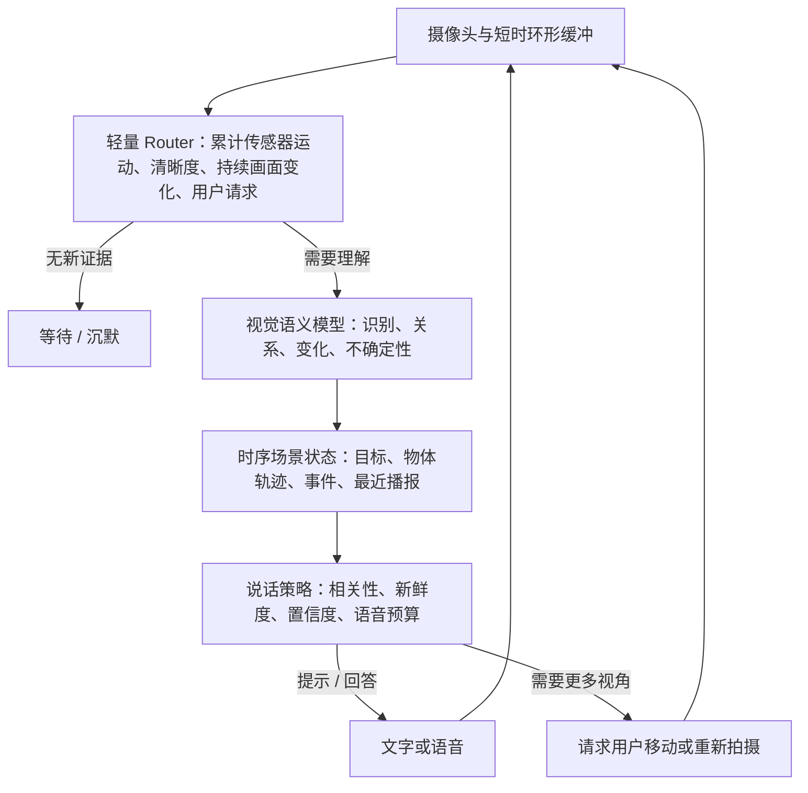

# 第一视角视觉助理：产品重设计（V1）

## 产品定义

这是一个通过手机摄像头理解用户周围环境、在合适时机用简短语言提供帮助的第一视角视觉代理。它的目标不是持续描述画面，而是帮助用户完成一个具体任务；没有新信息或可靠证据时，保持安静也是正确输出。

设计假设来自[原始草稿](references/草稿.md)和现有[框架文档](references/framework.md)：主要面向视障及低视力用户，外部交互以语言为主，先用手机建立可重复测试的环境。目标用户和任务仍需通过实测确认。

核心闭环：

```text
用户提出目标 / 开始观察
        ↓
摄像头持续采集，低成本模块判断是否值得分析
        ↓
视觉模型更新结构化场景状态
        ↓
系统判断信息是否相关、新鲜、可靠、值得打断用户
        ↓
说一句提示 / 回答 / 请求用户调整视角 / 保持安静
        ↓
用户行动，摄像头看到新画面，任务状态继续更新
```

## 产品形态

V1 聚焦三个可评测的任务，不做泛化的“陪用户生活”：

1. **找物**：用户说“帮我找钥匙”；系统保持搜索状态，识别候选物，必要时请用户慢慢转动手机，确认后用周围地标和对用户有用的位置线索说明目标在哪里。
2. **按需识别或读取**：用户询问当前观察到的物体、文字或环境，系统立即分析当前帧和短时间窗口，并直接回答用户关心的内容。
3. **条件提醒**：用户明确设置关注事项，例如“看到空座位时告诉我”；系统仅在出现新且可靠的相关信息时提示。

“刚才看到的门牌是什么”作为短期回顾任务加入实验集。开放式环境播报和安全导航不作为 V1 承诺。

用户不需要选择“节省模式 / 深度模式”。用户只表达目标；系统内部根据目标、画面变化和不确定性分配推理预算。预算模式是工程策略，不应成为主要产品交互。

## 系统结构



### 1. 感知输入与 Router

- 摄像头可以高频采集，模型不需要处理每一帧。保留短时 ring buffer，让触发后的分析能看到事件前后，而不是只看触发瞬间。
- Router V1 用便宜、可解释的信号：相机运动、模糊/稳定、帧差、候选物体变化、上次分析时间和用户请求。用户主动提问优先触发；画面剧烈运动时先等稳定帧。
- Quiet 默认不做固定间隔的模型调用；根据稳定后的新证据触发。Awareness 在用户启用 Watch 后每 15 秒复查一次关注条件，并可由新证据提前触发。近乎静止的输入合并成一张代表截图，设备运动或持续画面变化时在有限预算内保留更多连续截图。Router 根据短时累计 IMU 变化压缩出静止、旋转为主、可能平移、无规则或未知等模式及粗略置信等级；帧相似度只做多帧持续性过滤，不参与运动分类。VLM 不接收原始运动轨迹。手机稳定时，后三种交互模式更容易获得连贯证据。
- Router 的每次跳过、调用原因、选中帧和时间窗都要记录，便于回放和分析漏报。

### 2. 视觉语义模型

当前 Qwen 保留为可复现基线。模型作为**语义传感器**，输出场景观察、候选对象、变化、证据帧、置信度和不确定项；模型结果不直接等于用户听到的话。

首轮继续使用单次调用的规则化结构输出。弱强模型分流、第二个模型仲裁和微调都放到同一测试集证明有收益后再做。后续模型选择看连续第一视角视频、时序一致性、空间关系、延迟和结构化输出，不看模型名称是否带“具身”。

### 3. 时序与空间状态

每个观察至少记录：对象/事件 ID、描述、可用于帮助用户定位的线索、观测时间、置信度、证据帧、关联任务和新鲜度。保存当前目标、搜索阶段、短期事件以及最近播报，避免重复介绍已经说过的东西。

V1 回到手机摄像头的 2D 连续画面，不要求先重建 3D。模型输入代表用户手持手机正在观察的周围环境，用户听到的回答应面向用户的任务，而不是描述用户看不到的图像：

- 不要说“物体在图片/画面左侧”或其他图像坐标。内部可用图像区域帮助检测与跨帧跟踪，但不能直接把图像坐标读成语音方位。
- 优先用场景地标和物体关系定位，例如“桌上靠门的一侧”“椅子旁边的地面”。只有相机与用户身体朝向关系可靠时，才使用“你左边 / 你右边”。
- 手机可以独立于用户身体转动。位置不明确时，说明目标和已知地标，不猜用户身体方位；没有可靠线索时就不提供方向。
- 仅用 IMU 记录手机自身运动，不把它当成用户身体朝向或 3D 场景坐标。

### 4. 任务状态与主动观察

“找物”应有明确状态，而不是每轮重新做一遍问答：

```text
IDLE → SEARCHING → CANDIDATE_FOUND → VERIFYING → CONFIRMED → DONE
                  ↘ 证据不足：请求补充视角 / 继续搜索
```

候选物出现时先取得清晰的新帧再确认；目标离开视野后保留最后位置及其时间，但要标为过期。用户调整摄像头后重新定位，不把历史方位当成当前方位。

### 5. 说话策略与语言预算

策略层输出 `SPEAK`、`ANSWER`、`WAIT`、`ASK_FOR_VIEW` 或 `SILENCE`。提示类型区分为环境感知、目标信息、方向引导、警示、确认和回顾。

普通提示需同时满足任务相关、新鲜、有证据、达到置信度要求且没有近期重复。默认一句话；高优先级新信息可打断低优先级播报。无明确用户任务时以沉默为默认。V1 的警示能力只作为实验功能，不作为可靠的安全保障。

## 可迭代测试环境

每个实验应保留固定输入视频/截图、标注事件时间、目标、相对位置和期望提示窗口，并记录 Router 决策、模型输入、模型输出、策略结果、延迟、调用量和人工反馈。相同输入可以比较模型、触发策略和说话策略。

核心指标：

- 任务成功率、找物耗时、目标识别率和面向用户的定位线索正确率；
- 把图像方位误说成用户方位的次数（目标为 0）；
- 有用提示召回率、误提示率、重复播报数/分钟；
- 事件到提示的延迟，以及过期空间提示比例；
- 每分钟模型调用量、成本和请求失败率。

V1 首批测试用短的第一视角片段覆盖：目标一直可见、目标短暂出现、相机转向、目标被遮挡、目标被移动、文字读取和无相关变化。先建立人工标注和视频回放，再用真实用户任务校准指标与语音打断策略。

### 虚拟物理环境的时机

当前先做**录制视频回放**，不搭完整物理模拟器。第一阶段的主要问题是视觉触发时机、跨帧判断、提示是否有用以及端到端延迟；固定录像能低成本、可重复地测这些指标。它也能先成为之后连接真实手机或模拟器的共同评测入口。

当系统开始给机器人发出可执行动作，例如转向、靠近、避障或抓取，再引入物理仿真来检查动作闭环、碰撞风险和重复性。仿真不能替代真实环境评测，因此用它筛查和复现问题，最终仍要在真实设备上验证感知与操作表现。

## 当前原型与新设计的差距

现有程序已有手机摄像头预览、手动抓拍、摄像头授权后自动抓拍与事件观察、短时帧缓存、Qwen 节省/深度调用、人工问题输入、实验记录和反馈。前端以四个清晰按钮进入 Quiet、Awareness、Task、Explore；采集细节收纳在高级设置。首轮改造已有低分辨率本地变化 Router、截图清晰度/曝光/近重复筛选、无定时 heartbeat 的 Quiet、场景状态与变化标记、条件 Watch 的疑似复核与一次性提示、找物 Task 阶段、已呈现事实去重及代码侧输出策略。主 Router 已接入手机运动传感器的累计窗口摘要，原始读数保存在实验记录；模型调用前先合并近重复帧，并按位置、摄像头朝向和行进方向是否变化调整 Quiet/Awareness 帧预算。VLM 只接收这三个维度的“无显著变化 / 显著变化 / 未知”状态和粗略置信度，不接收速度值、方向向量或原始轨迹。Awareness 每 15 秒复查启用的 Watch；Quiet 不做定时复查。稳定手机更利于连续判断，匀速平移仍可能未知，IMU 也不是绝对位移传感器。只有浏览器权限仍需用户明确授予；摄像头开启后无需再手动开启自动抓拍和观察。

下一阶段应优先补：

1. 做固定短视频的可回放 Router 与任务评测，加入事件级人工标注；
2. 根据真实片段校准画面变化、IMU 运动阈值、稳定时间窗和语音重复抑制；
3. 为无障碍体验加入可控的语音输出并评测打断成本；
4. 验证找物闭环后，继续评估更强的多模态模型和连续帧理解，重点看任务完成率与面向用户的位置提示正确率；
5. 只有当实测任务明确需要 3D、且存在可验证的模型和数据链路时，再重新评估 3D 建模；机器人动作控制需求出现后，再选合适的物理仿真环境。

**产品验收标准**不是“模型能讲出截图里有什么”，而是“用户给出任务后，系统能在合适的时机给出正确、简短、不过期的提示；其余时间不打扰用户”。
